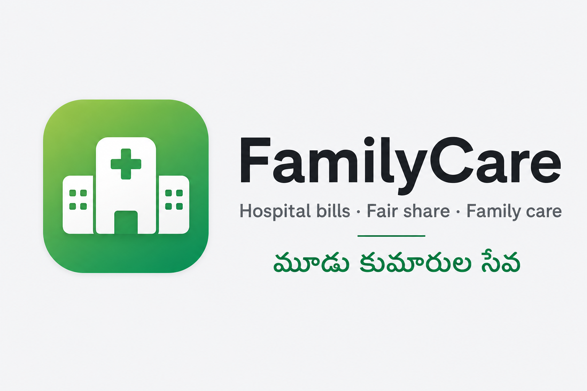

# FamilyCare · Hospital Bills

[](https://tevskrishna.github.io/hospital-bills/)
[](version.json)
[](LICENSE)

Premium family app to track **Mallareddy Hospital** bills for **Sri Venkateswara Rao** — fair 1/3 split between three sons, WhatsApp family summary, and care updates.

**Live:** [https://tevskrishna.github.io/hospital-bills/](https://tevskrishna.github.io/hospital-bills/)



---

## Features

| Feature | Description |
|---------|-------------|
| **Dashboard** | Greeting, patient card, spend hero, progress rings, recent activity |
| **Bills** | Search, filters, monthly groups, premium transaction cards |
| **Fair share** | Automatic 1/3 split — settlement logic unchanged since v1 |
| **Share** | Live WhatsApp preview + one-tap copy |
| **Care** | Health timeline, prescription OCR, Q&A assistant |
| **PWA** | Installable, offline shell, background sync queue |
| **Sync** | GitHub Contents API or Google Sheets (optional) |
| **Telugu + English** | Bilingual labels throughout |

---

## Architecture (v25 LTS)

```
index.html              ← App shell (HTML only)
css/                    ← theme, app, components, utilities, animations, responsive
js/                     ← 14 modules (config, sync, render, …)
data/bills.json         ← Source of truth on GitHub Pages
sw.js                   ← Service worker (cache + offline)
manifest.json           ← PWA manifest
dist/                   ← Production deploy (obfuscated app.min.js only)
```

**No backend.** Writes via GitHub PAT (localStorage) or Google Web App URL.

**LTS docs:** [DEPLOYMENT_GUIDE.md](DEPLOYMENT_GUIDE.md) · [MAINTENANCE_GUIDE.md](MAINTENANCE_GUIDE.md) · [LTS_FINAL_AUDIT.md](LTS_FINAL_AUDIT.md)

---

## Quick start

### Family (view only)

Open the live URL on any phone. Add to Home Screen for app-like experience.

### Venky (admin — add bills)

1. Open app → **Bills** tab → scroll to **Phone setup**
2. Paste GitHub personal access token → Save
3. Tap **+** to add bills — family sees updates in ~1 min

Details: [MOBILE-VENKY.md](MOBILE-VENKY.md) · [SETUP-COMBINED.md](SETUP-COMBINED.md)

---

## Deployment

```powershell
cd "c:\Users\Admin\Desktop\Hospital bills"
Copy-Item index.html hospital-bills.html -Force
git add -A && git commit -m "release: v23" && git push origin main
```

GitHub Pages deploys from `main`. See [DEPLOY.md](DEPLOY.md).

---

## Roadmap

| Version | Status |
|---------|--------|
| v22 | Premium consumer UI |
| v23 | QA polish, PWA, Lighthouse, TEST_PLAN |
| Future | Optional backend for token security |

Full roadmap: [ROADMAP.md](ROADMAP.md)

---

## Contributing

1. Read [CONTRIBUTING.md](CONTRIBUTING.md)
2. **Never change** `computeSettlement()` or `computeSplit()` without family approval
3. Run manual tests from [TEST_PLAN.md](TEST_PLAN.md)

---

## FAQ

**Q: Who pays whom?**  
Kalyan settles to whoever paid extra (Deepa/Venky). Venky never pays Deepa directly. Shivaji→Venky advances are separate.

**Q: Stuck on old version?**  
Open [refresh.html](https://tevskrishna.github.io/hospital-bills/refresh.html)

**Q: Works offline?**  
Yes — cached shell loads; latest bills need network.

**Q: Is data private?**  
Bills are in a public GitHub repo. Do not put sensitive medical details in notes.

---

## License

MIT — family use. Built with care for the Venkateswara Rao family.

**Powered by [Tevs](https://github.com/Tevskrishna)**
